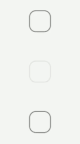

# Design System Mobile for Flutter

[Design System Mobile](https://designsystems.app.sbb.ch/) in Flutter (yes, it could be that easy...). 

*Note:* This plugin is still under development and some APIs might change. Feedback and Pull Requests are most welcome!
## Usage
---
To use this plugin, add `design_system_flutter` as a [dependency in your pubspec.yaml file](https://flutter.io/platform-plugins/). As this is a private plugin, you must add it as a Git dependency:
```yaml
dependencies:
  design_system_flutter:
    git:
      url: ssh://git@codessh.sbb.ch:7999/kd_flutter/design_system_flutter.git
```
## Getting Started
---
### Dart/Flutter Integration
From your Dart code, you need to import the plugin and instantiate it:
```Dart
import 'package:design_system_flutter/design_system_flutter.dart';
```

After that simply use the provided fonts, styles, colors, widgets...

# Widget Catalog
---
## SBBCheckBox


