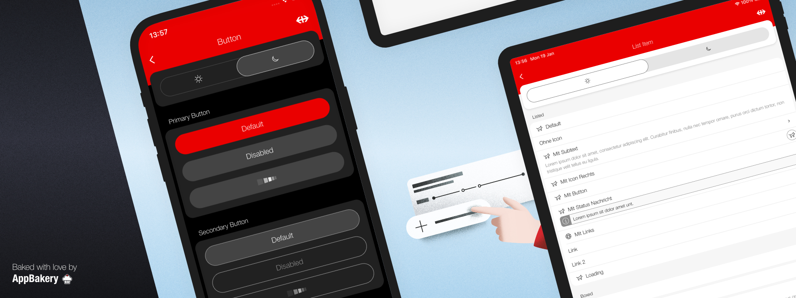

[](https://github.com/SchweizerischeBundesbahnen/design_system_flutter/actions/workflows/nightly-build.yaml)
[](https://pub.dev/packages/sbb_design_system_mobile)


This Flutter package contains the official UI components of the SBB (Swiss Federal Railways) [Design System Mobile].
The design system enables a consistent digital presence for SBB but also provides a flexible approach to theming and 
component structure to support a wide range of design requirements.

## Getting Started

#### Supported platforms

<div id="supported_platforms">
  
  
</div>

#### Setup theming

In order for the theming to work, you need to add the `SBBTheme.light` / `SBBTheme.dark` to your app root.

For a `MaterialApp`:

```Dart
import 'package:sbb_design_system_mobile/sbb_design_system_mobile.dart';

void main() {
  runApp(const MyApp());
}

class MyApp extends StatelessWidget {
  const MyApp({super.key});

  @override
  Widget build(BuildContext context) {
    return MaterialApp(
      title: 'SBB DSM',
      theme: SBBTheme.light(),
      darkTheme: SBBTheme.dark(),
      home: const MyHomePage(),
    );
  }
}
```

To get theming for off-brand or safety-relevant apps, use `SBBThemeContext`. Example usage: `SBBTheme.light(themeContext: .offBrand)`.

`SBBColorScheme` is used to define most default colors used by the components, which can be accessed by `Theme.of(context).sbbBaseStyle.colorScheme`.
You can also provide a custom `SBBColorScheme` for your app by passing it to `SBBTheme` over `SBBBaseStyle`.

#### Component theming

Each component has a `ThemeExtension` which is added to `ThemeData.extensions`. You can access them by using the provided 
helper methods like `Theme.of(context).sbbSwitchTheme`.

To customize a component, you can override the component's `ThemeExtension` for the `SBBTheme`. If you only want to change the appearance 
of a single component, use the provided `style` attributes. Only non-null properties or non-null resolved [WidgetStateProperty] values 
override the default values.

```Dart
// theme wide styling
SBBTheme.light(
  headerTheme: SBBHeaderThemeData(
    style: SBBHeaderStyle(
      backgroundColor: SBBColors.green,
    ),
  ),
)

// single component styling
SBBHeader(
  titleText: 'Design System Mobile',
  style: SBBHeaderStyle(backgroundColor: SBBColors.green),
)
```

### Example App

The **Flutter DSM** example app is currently only available in the SBB Enterprise Stores.
Build the example app in `example` to try it yourself.

<p align="left"></p>

## Documentation

#### Design System Mobile specification

The elements follow the design specifications found in [Design System Mobile] as closely as possible.

The pixel exact specifications can be found in the [Figma](https://www.figma.com/design/WOtLIam1xwrqcgnAITsEhV/Design-System-Mobile) (view only).

#### SBB internal documentation

At the moment, the following documents are only available to people internal to SBB:
* [AppBakery libraries](https://sbb.sharepoint.com/sites/app-bakery/SitePages/Mobile-Libraries.aspx "AppBakery libraries")

### Read on

- [Getting Started SBB Design System](https://digital.sbb.ch/de/design-system/getting-started/designing/)
- [Accessibility](https://digital.sbb.ch/de/accessibility/introduction/about-this-guide/)
- [Colors](https://digital.sbb.ch/de/foundation/colors/base-colors/)
- [Principles](https://digital.sbb.ch/de/principles/ux-principles/overview/)

## License

This project is licensed under [MIT](LICENSE).

## Contributing

Generally speaking, we are welcoming contributions improving existing UI elements or fixing certain bugs. We will also consider contributions introducing new design elements, but might reject them, if they do not reflect our vision of SBB Design System.

General instructions on _how_ to contribute can be found under [Contributing](CONTRIBUTING.md).


### Testing
This project is built and tested using [Github Actions](https://docs.github.com/en/actions). On every PR request, a `test` workflow is triggered, which does the following:

* running all tests in the `.\test\` dir. Failed golden tests will be uploaded to the job artifacts. The tests run on a _macos_ runner.
* parse the `CHANGELOG.md` file and compare against the [Keep A Changelog](https://keepachangelog.com/en/1.1.0/) schema. This allows for automatic release notes from our Changelog.
* Build the example app in `example` for the minimum and latest supported Flutter SDK for both iOS and Android.

### Coding Standards

See [CODING_STANDARDS.md](CODING_STANDARDS.md).

### Code of Conduct

See [CODE_OF_CONDUCT.md](CODE_OF_CONDUCT.md).

### Releasing

See [RELEASE.md](RELEASE.md).

## Maintainer

* [Ralf Winkelmann](https://github.com/rawi-coding)
* [Nico Vidoni](https://github.com/smallTrogdor)
* [Simon Meer](https://github.com/simon-meer)

## Credits

In addition to the contributors on GitHub, we thank the following authors for their previous work:
*  Patrice Müller
*  Dominik Schmucki

[Design System Mobile]: https://digital.sbb.ch/en/design-system/mobile/overview/
